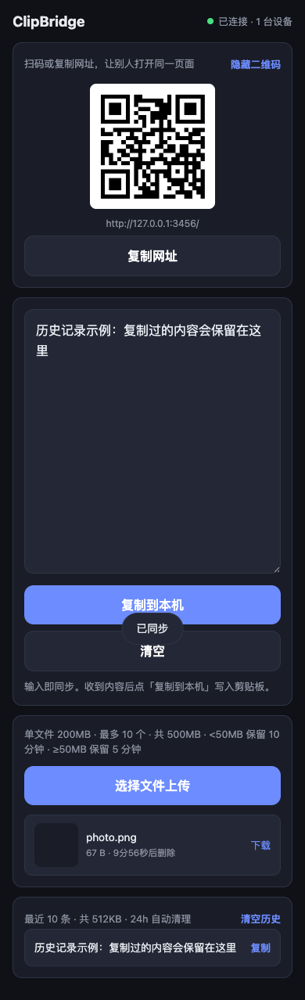
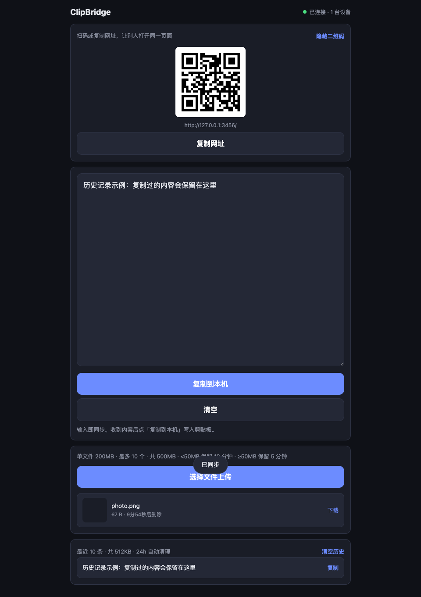

# ClipBridge

局域网共享剪贴板 + 文件传输。同一个局域网内，大家打开同一个网址：

- **文本**：输入即同步，点「复制到本机」写入剪贴板
- **文件**：上传照片/文档，其他设备直接下载
- **扫码**：页面自带二维码，手机扫一下就能打开

## 界面预览

手机端：



桌面端：



## 功能一览

| 功能 | 说明 |
|------|------|
| 实时同步 | WebSocket 推送 + HTTP 兜底，输入约 1 秒内同步 |
| 扫码进入 | 自动生成当前地址的二维码 |
| 粘贴历史 | 最近 10 条，可随时复制；支持手动清空 |
| 文件传输 | 照片/文档上传，图片显示缩略图 |
| 访问密码 | 可选 `PIN` 环境变量，默认无需密码 |

### 资源保护

**内存（粘贴历史）**

- 最多 10 条，合计 512KB，单条最多 64KB
- 24 小时自动清理
- 可点「清空历史」立即释放

**磁盘（文件传输）**

- 单文件最大 200MB，最多 10 个，总计 500MB
- < 50MB 保留 10 分钟，≥ 50MB 保留 5 分钟
- 流式写盘，不占内存；**不需要** `docker run -v`

## 项目结构

```
.
├── server.js            后端入口：WebSocket + API
├── files.js             文件传输：流式上传/下载/清理
├── public/              前端页面
│   ├── index.html
│   ├── style.css
│   └── app.js
├── docs/screenshots/    README 截图
├── scripts/capture.mjs  本地截图脚本
├── test/smoke.test.js   冒烟测试
├── Dockerfile
└── docker-compose.yml
```

## 方式一：进程启动（本机 / 服务器）

需要 Node.js 18 以上。

```bash
npm install      # 首次安装依赖
npm start        # 启动，默认端口 3456
```

浏览器打开 `http://<本机IP>:3456`。手机和电脑需在同一 WiFi。

常用环境变量（都可省略）：

| 变量 | 说明 | 默认 |
|------|------|------|
| `PORT` | 监听端口 | `3456` |
| `PIN`  | 访问密码 | 空（无需密码） |

```bash
PORT=8080 PIN=1234 npm start
```

## 方式二：Docker Compose

```bash
docker compose up -d --build     # 启动
docker compose logs -f           # 看日志
docker compose down              # 停止
```

```bash
PORT=8080 PIN=1234 docker compose up -d --build
```

## 方式三：docker run

本地构建后运行：

```bash
docker build -t clipbridge .
docker run -d --name clipbridge --restart unless-stopped \
  -p 3456:3456 \
  clipbridge
```

或直接拉镜像（无需源码）：

```bash
docker run -d --name clipbridge --restart unless-stopped \
  -p 3456:3456 \
  registry.cn-hangzhou.aliyuncs.com/valv/copy:1.3.2
```

改端口 / 加密码（容器内固定 3456）：

```bash
docker run -d --name clipbridge --restart unless-stopped \
  -p 8080:3456 \
  -e PIN=1234 \
  clipbridge
```

容器管理：

```bash
docker logs -f clipbridge
docker stop clipbridge
docker rm -f clipbridge
```

## 使用说明

1. 电脑打开 `http://<软路由或本机IP>:3456`
2. 手机扫页面二维码，或手动输入同一地址
3. **传文字**：在输入框打字或粘贴 → 自动同步 → 点「复制到本机」
4. **传文件**：点「选择文件上传」→ 选照片或文件 → 其他设备点「下载」

## 测试

```bash
npm test
```

## 更新 README 截图

本地启动服务后执行：

```bash
npm start
node scripts/capture.mjs
```

截图会保存到 `docs/screenshots/`。
